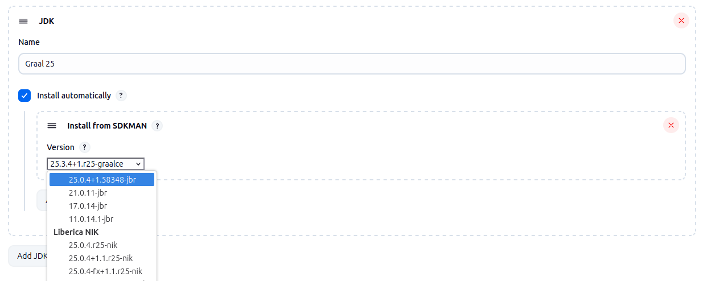
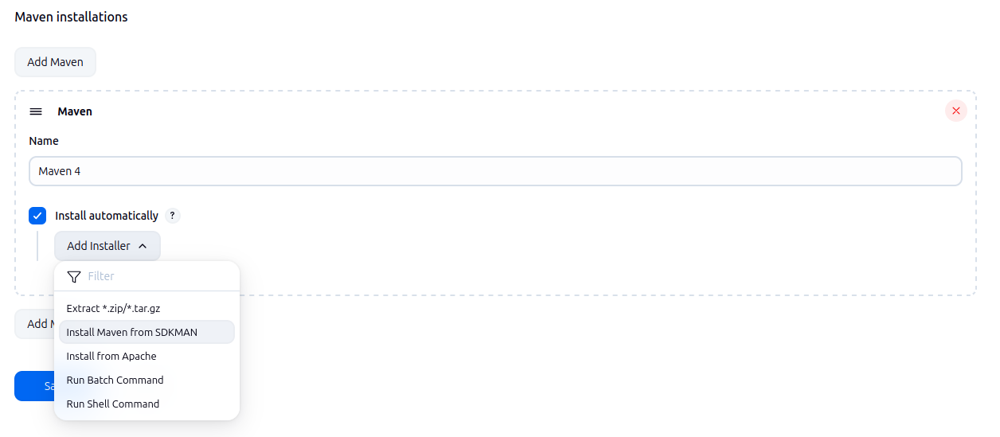
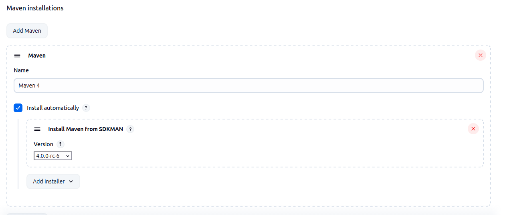
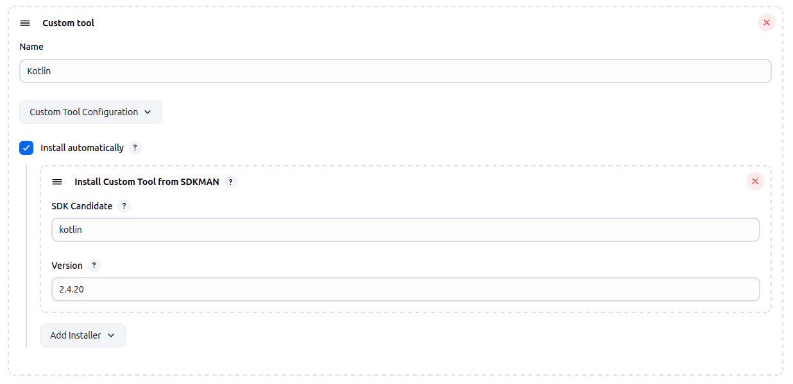

# sdkman-tool-installer-plugin

## Introduction

This plugin adds Jenkins tool installers backed by [SDKMAN!](https://sdkman.io/), allowing Jenkins to download and install supported developer tools automatically when a build needs them.

It currently provides SDKMAN-based installers for:

- JDK
- Maven
- Ant
- Gradle
- Groovy
- Custom Tool entries, where the SDKMAN candidate and version are entered manually

For the built-in tool types, Jenkins administrators can select a version directly in Global Tool Configuration and let the plugin resolve the correct archive for the target agent platform. For JDKs, the installer also exposes the vendor-specific distributions available through SDKMAN.

This can be especially useful when you want Jenkins to manage tool installation across a varied or rapidly changing build fleet:

- **Multi-OS build farms** – the same Jenkins tool definition can be installed on Linux, macOS, or Windows agents without maintaining separate download URLs by hand.
- **Multi-architecture environments** – SDKMAN can resolve platform-specific binaries for x64 and ARM agents, which is helpful when your farm mixes traditional servers with ARM-based builders.
- **Ephemeral or dynamically provisioned agents** – when agents are created on demand from cloud templates, containers, or virtual machines, tools can be installed automatically at first use instead of being baked into every image.
- **Reduced image maintenance** – rather than preinstalling every possible JDK or build tool in every node image, you can keep agent images smaller and let Jenkins fetch only what a job actually requires.
- **Consistent tool management** – versions are configured centrally in Jenkins instead of spread across bootstrap scripts or per-node manual setup.

In short, this plugin is most useful when you want centrally managed, on-demand tool installation through Jenkins while still benefiting from SDKMAN's catalog of developer tools and platform-aware downloads.

## Getting started

### 1. Install the plugin

Install the plugin in Jenkins and restart if required.

### 2. Configure a tool in Global Tool Configuration

Go to **Manage Jenkins** -> **Tools** and locate the tool type you want to configure:

- **JDK**
- **Maven**
- **Ant**
- **Gradle**
- **Groovy**
- **Custom Tool**

Add a new tool installation as usual, then add the appropriate **SDKMAN** installer.

For most supported tool types, you can select the version from the drop-down populated from SDKMAN.

For **Custom Tool**, enter both values manually:

- the SDKMAN candidate name, for example `kotlin`
- the exact version identifier, for example `2.4.20`

### 3. Save and use the tool in jobs or Pipelines

Once saved, Jenkins will install the requested tool on the agent the first time it is needed.
The plugin resolves the correct platform-specific download for the target node, which is especially useful when your Jenkins environment includes different operating systems or CPU architectures.

### Screenshots

#### Adding a JDK tool



#### Selecting SDKMan as tool installer for Maven



#### Adding a Maven tool



#### Adding a Custom tool



### Example: JDK in Pipeline

```groovy
pipeline {
	agent any

	tools {
		jdk 'temurin-21'
	}

	stages {
		stage('Java version') {
			steps {
				sh 'java -version'
			}
		}
	}
}
```

In this example, `temurin-21` is the Jenkins tool name you created under **JDK installations**. If the selected agent does not already have that tool installed in Jenkins' tool cache, the SDKMAN installer will download it automatically.

### Example: Maven in Pipeline

```groovy
pipeline {
	agent any

	tools {
		maven 'maven-3.9.16'
	}

	stages {
		stage('Build') {
			steps {
				sh 'mvn -version'
			}
		}
	}
}
```

### Example: Custom Tool in Pipeline

If you use the Custom Tools plugin together with a manually configured SDKMAN candidate and version, you can reference the tool by its Jenkins tool name:

```groovy
pipeline {
	agent any

	stages {
		stage('Use custom SDK') {
			steps {
				script {
					def toolHome = tool 'kotlin-2.4.20'
					env.PATH = "${toolHome}/bin:${env.PATH}"
				}
				sh 'kotlin -version || true'
			}
		}
	}
}
```

### Configuration as Code

Exact Configuration as Code structure can vary depending on the tool type and the surrounding tool definition, but the installer blocks follow the usual Jenkins tool model.

Example shapes:

```yaml
tool:
  jdk:
	installations:
	  - name: "temurin-21"
		properties:
		  - installSource:
			  installers:
				- sdkmanToolInstaller:
					id: "21.0.12+1.1-tem"

  maven:
	installations:
	  - name: "maven-3.9.16"
		properties:
		  - installSource:
			  installers:
				- sdkmanMavenToolInstaller:
					id: "3.9.16"
```

For Custom Tools, the installer requires both the candidate and version identifier:

```yaml
tool:
  custom:
	installations:
	  - name: "kotlin-2.4.20"
		properties:
		  - installSource:
			  installers:
				- sdkmanCustomToolInstaller:
					candidate: "kotlin"
					id: "2.4.20"
```

If you plan to rely heavily on automatic tool installation, it is a good idea to test each configured tool once on every major agent type in your fleet so Jenkins can verify that the expected SDKMAN artifact is available for that platform.

## Issues
Report issues and enhancements in the [Jenkins issue tracker](https://issues.jenkins.io/).

## Contributing

Refer to our [contribution guidelines](https://github.com/jenkinsci/.github/blob/master/CONTRIBUTING.md)

## LICENSE

Licensed under MIT, see [LICENSE](LICENSE.md)

